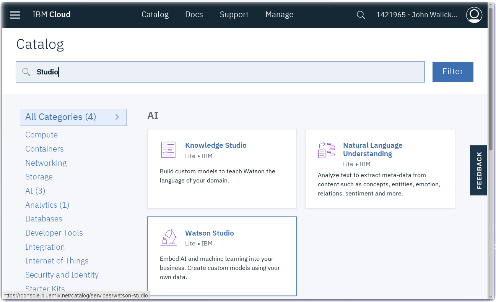
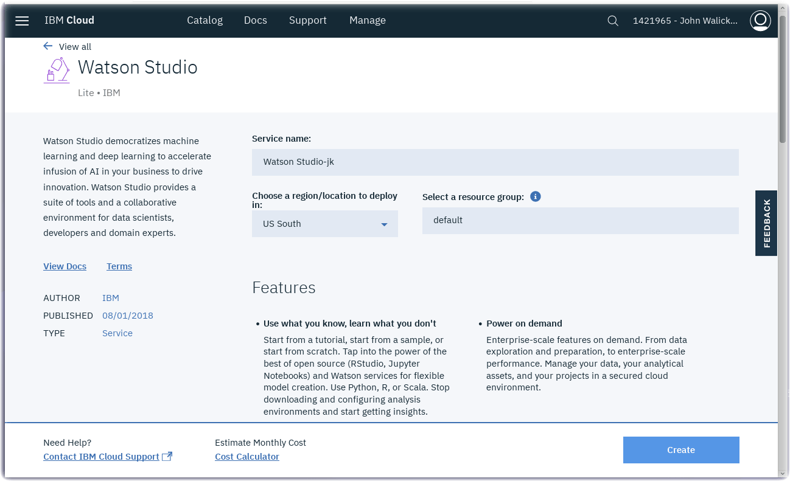
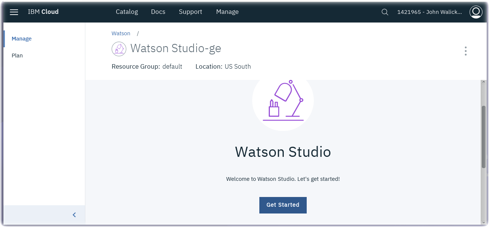
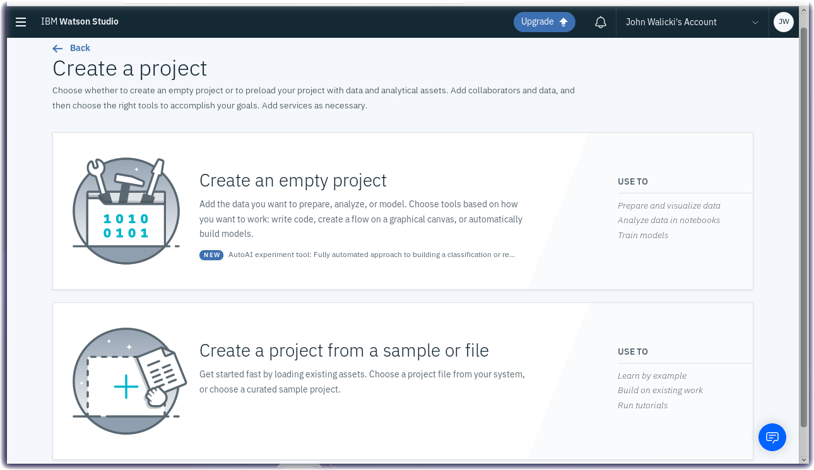
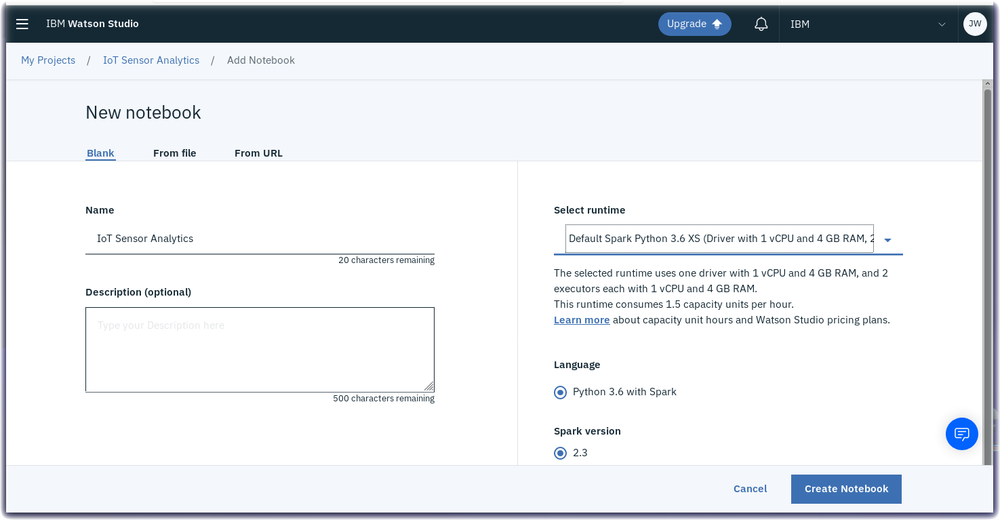
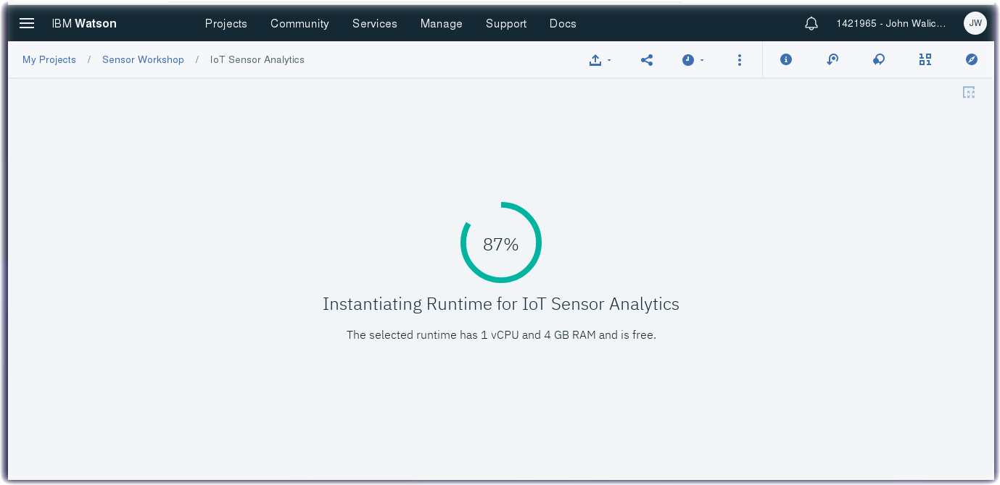

*Quick links :*
[Home](/README.md) - [Part 1](../part1/README.md) - [Part 2](../part2/README.md) - [Part 3](../part3/README.md) - [**Part 4**](../part4/README.md)
***
**Part 3** - [**Watson Studio**](STUDIO.md) - [Training Data](TRAINING.md) - [Notebooks](JUPYTER.md) - [ESP8266 model](MODEL.md) - [Summary](SUMMARY.md)
***

# Watson Studio Set up and Configuration in IBM Cloud

## Lab Objectives

In this lab you will set up Watson Studio with a new Project.  You will learn:

- Watson Studio
- How to set up a new Watson Studio Project
- How to create a Jupyter Notebook

### Introduction

Watson Studio accelerates the machine and deep learning workflows required to infuse AI into your business to drive innovation. It provides a suite of tools for data scientists, application developers and subject matter experts, allowing them to collaboratively connect to data, wrangle that data and use it to build, train and deploy models at scale. Successful AI projects require a combination of algorithms + data + team, and a very powerful compute infrastructure.

- Learn more from the Experts - [Introducing IBM Watson Studio](https://medium.com/ibm-watson/introducing-ibm-watson-studio-e93638f0bb47)

### Step 1 - Watson Studio Setup

Watson Studio needs a data store to enable it to work and it uses the Cloud Object Storage service, so you need an instance of that service available.  On a lite account you can only have a single instance of this service deployed, so if you already have an Object Storage service deployed then you will need to use that, otherwise you can deploy one when you create your notebook.

#### Create a Watson Studio service instance

- Create a **Watson Studio** service instance from the [IBM Cloud Catalog](https://cloud.ibm.com/catalog/?search=studio)
- Search on **Studio** in the IBM Cloud Catalog

- Click on the **Watson Studio** service tile

- Click on the **Create** button
- After the Watson Studio service is created, click on **Get Started**

- Optionally, walk through the introductory tutorial to learn about Watson Studio

### Step 2 - Create a New Project

Projects are your workspace to organize your resources, such as assets like data, collaborators, and analytic tools like notebooks and models

#### Create a New Project

- Click on **Create a project**

- Select the **Create an empty project** tile

- Give your Project a name : **IoT Sensor Analytics**
- Click on **Add** to define a Cloud Object Storage instance

#### Create Cloud Object Storage
- You will store training data in a Cloud Object Storage bucket
- Select the **Lite** plan and note the features
- Scroll to the bottom and click on the **Create** button and then **Confirm** to create a Cloud Object Storage instance.

- Click on **Refresh** on the New Project tab.
- Click on **Create** to create the new project.

### Step 3 - Create a Notebook

- From the top menu, select **Add to project**, and then **Notebook**
- Select **Blank**
- Give the notebook a name : **IoT Sensor Analytics**
- Scroll down to the **Select runtime** dropdown and choose **Default Spark Python 3.6 XS (Driver with 1 vCPU and 4 GB RAM, 2 executors with 1 vCPU and 4 GB RAM each** runtime

- Click on **Create Notebook**

You are now ready to create the training data we will use, so proceed to the next [Training Data section](TRAINING.md).

***
**Part 3** - [**Watson Studio**](STUDIO.md) - [Training Data](TRAINING.md) - [Notebooks](JUPYTER.md) - [ESP8266 model](MODEL.md) - [Summary](SUMMARY.md)
***
